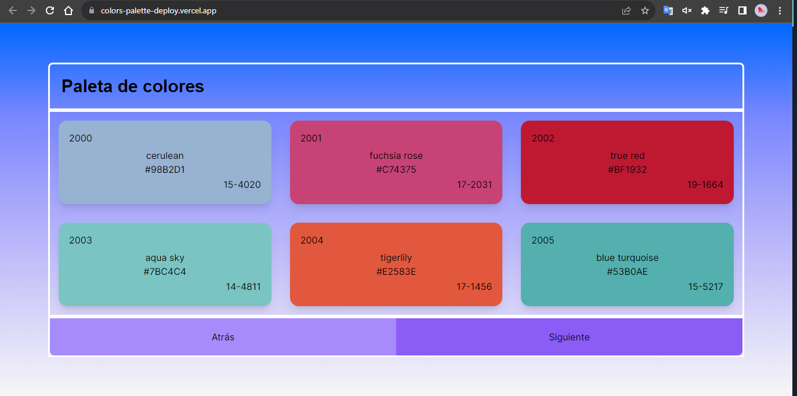

# Colors Palette

The application allows you to copy the hexadecimal code of each color you select



- Demo: [APP](https://colors-palette-deploy.vercel.app/)
- Api: [LINK](https://reqres.in/api/colors)

---

## Development Tools

- NextJS
- React
- TypeScript
- Tailwind


## Start the project

- clone repository
- install dependencies

```
$ npm run install
```
```
$ npm install dotenv
```

- initialize eslint from next
```
$ npx eslint --init
```

- add .env.development file and configure
```
$ NEXT_PUBLIC_URL = https://reqres.in/api/colors
```

- add the following rules in .eslintrc.json
```
$ "react/prop-types": "off",
$ "react/react-in-jsx-scope": "off",
$ "@typescript-eslint/no-floating-promises": "off",
$ "@typescript-eslint/explicit-function-return-type": "off",
$ "@typescript-eslint/no-misused-promises": "off"
```

- run the project
```
$ npm run dev
```
